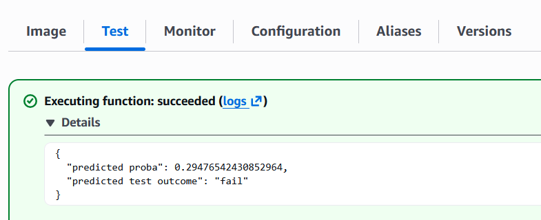

# Semiconductor Manufacturing Line Test Prediction Model
## Purpose
This project was created to be submitted as Capstone Project for the [Machine Learning Zoomcamp](https://github.com/DataTalksClub/machine-learning-zoomcamp) (2025 cohort).

## Problem Description
Production lines in manufacturing facilities make use of monitoring systems to detect potential issues and failures as early as possible so that they can be fixed as quickly as possible. Such monitoring systems typically use numerous sensors to monitor the different production steps. This usually results in large amounts of sensor data being collected. 

It then becomes a challenge to understand which sensor signals within the collected data are the most useful for identifying potential issues in the production line that require human intervention. This is where machine learning algorithms can help identify the most relevant sensor signals, as well as help build models that accurately identify when issues that require fixing occur.

## Project Goal
This project analyses real monitoring data collected from a semiconductor production line. The goal is to identify which are the most relevant signals within the many measured sensor signals, and based on those signals, train a machine learning model that accurately predicts the pass or fail of production line tests.

It is worth mentioning that the primary goal of this project is to demonstrate the steps involved in training and deploying a machine learning model, not to obtain the best performing model.

## Data Description
The data used for this project is the SECOM dataset, which is provided on the following page: https://doi.org/10.24432/C54305

Note: a function has been implemented to automatically download and extract the data before the data is loaded.

The dataset contains 1567 sets of measurements with 590 features (i.e. measured signals). Out of the 1567 measurements, the test outcome is a fail in 104 cases.

The data provided at the URL indicated above consists of a zip file that contains 3 files:
- secom.data: contains the selection of measured data (1567 rows and 590 columns).
- secom.names: includes information regarding the dataset.
- secom_labels.data: contains the labels that represent the outcome of the line testing for each measurement (–1 corresponds to a pass and 1 corresponds to a fail), along with a datetimestamp.

## Data Analysis and Preprocessing
The main points uncovered during the data analysis (performed in ```notebook.ipynb```) are the following:
- All columns in the dataset containing the features are numerical
- Some columns have quite a lot of missing values: for 28 columns, more than 50% of the values are missing. These columns are dropped during preprocessing.
- 116 columns contain constant values. They are removed during preprocessing, since they do not add any predictive information.
- A lot of features are highly correlated (> 0.9). For each pair of highly correlated feature, the one with lowest variance is dropped during preprocessing.
- There are no missing values in the labels.
- The labels indicate that 1463 of the measurements correspond to a test pass (value of -1), while 104 correspond to test fail (value of 1), which is equivalent to 6.6% of test fails.

Given the relatively high number of features, no attempt was made to visualise them.

For applying the preprocessing steps, a transformer object is defined for each preprocessing step. In addition to the preprocessing steps described above, any missing value is imputed with the median of its column.

The resulting transformer objects are combined into a preprocessing pipeline.

## Model Training and Selection
5 types of binary classifiers were trained and evaluated:
1. Logistic regression
2. Ridge classifier
3. Decision tree classifier
4. Random forest classifier
5. XGBoost classifier

A grid search was performed to find the best combination of parameter values for each model. The PR-AUC (a.k.a. average precision) was used for selecting the best set of parameters for each model.

Since the number of measurements is relatively low for the number of features, cross-validation was implemented using 5 splits.

As the target labels are imbalanced, a search was performed to determine the optimal decision threshold value for classifying whether a given probability should correspond to a pass or a fail. The optimal threshold was determined based on the F1-score computed on the validation data, by identifying the threshold that provided the highest F1-score.

Based on the PR-AUC and ROC-AUC values obtained both on the training and validation data, as well as the F1-score, the **random forest classifier** was found to be overall the best performing model, given the ranges of parameters tested.

The random forest classifier was subsequently refitted using the training and validation data, using the best parameter values found during the training stage. The optimal threshold was searched for again and identified to be 0.28.

The code for training the random forest classifier using the best parameter values found was transferred to the ```train.py``` and ```preprocessing.py``` scripts.

Refer to the ```notebook.ipynb``` for more details regarding the training and evaluation of the models.

## Dockerization and Model Deployment
A Dockerfile was setup for this project to make the ```predict.py``` script available as a Lambda function on AWS. To avoid any unwanted costs due to potential abuse, the function is not exposed publicly.

The Docker image was built by running the following command:
```bash
    docker build -t secom-test-prediction .
```

An Elastic Container Repository (ECR) was created on AWS using the following command:
```bash
aws ecr create-repository \
  --repository-name "secom-test-prediction" \
  --region "ap-southeast-2"
```

The Docker image was then pushed to the repository by running the ```publish.sh``` script:
```bash
bash publish.sh
```

The Lambda function was created manually through the AWS cloud console.

The following screenshot shows the deployed function:


The function was tested successfully using the sensor data contained in ```test_sensor_data.json```:


## How to Test the Model Locally
### Option 1: Download the Image from Docker Hub (if Available)
The image has been made available on Docker Hub for a limited time (it might no longer be available when you read this). To be able to use it, you need to have Docker installed on the machine you want to run the image on, and you need an account that allows you to access Docker Hub.

1. First check if the image is still available:
    ```
    docker manifest inspect davidvfitzgerald/secom-test-prediction:prod
    ```

    If information is returned, this means the image is still online and can be used. If the message "no such manifest" is returned, then the image is no longer online, and you will need to use the [other option](#option-2-clone-the-repository-and-build-docker-image) to run the service locally.

2. If the image is available, run the following commands to download the image and run it:
    ```
    docker pull davidvfitzgerald/secom-test-prediction:prod
    ```
    ```
    docker run -p 8080:8080 davidvfitzgerald/secom-test-prediction:prod
    ```

3. To test model, run the following bash commands:
    ```
    PAYLOAD='{"sensor_data": [3076.38, 2475.53, 2166.5222, 907.0746, 1.0647, 100.0, 104.5211, 0.1221, 1.4919, -0.003, 0.0034, 0.9493, 200.0401, 0.0, 13.9864, 420.1404, 10.6454, 0.9748, 189.3948, 12.4871, 1.3991, -3281.0, 1523.25, -2015.25, 264.0, 0.4397, 0.8885, 1.4655, 63.1333, 2.2778, 0.1951, 3.4174, 84.0432, 8.7487, 50.2849, 64.3732, 49.7151, 66.6566, 88.2425, 118.7784, 14.41, 5.143, 70.0, 351.1173, 10.0379, 134.3664, 726.5571, 1.3681, 142.5236, 1.0, 628.0073, 241.0536, 0.0, 4.567, 4.824, 2856.0, 0.9324, 0.9465, 4.5894, 12.0945, 349.5364, 10.754, 106.4609, 20.0673, 27.9055, 36.6103, 689.9468, 0.9556, 151.9427, 1.0, 607.94, 107.4107, 143.179, 464.761, 0.0, -0.0239, -0.0263, -0.059, -0.0473, 0.0155, -0.0885, -0.0261, -0.0007, 6.7359, 0.1342, null, 2.4535, 0.9895, 1823.9266, 0.2211, 8621.6501, 0.0272, -0.0009, -0.0028, 0.0, 0.0001, -0.0999, 0.0, 0.1838, 0.0149, 0.0, 0.0001, 0.0276, -0.0071, -0.0002, 0.0009, 0.0028, -0.0929, -0.113, null, null, null, 0.462, 0.9398, 0.0, 656.7325, 0.9907, 57.648, 0.6032, 0.9768, 6.3123, 15.87, 3.628, 15.92, 15.9, 1.021, 2.564, 0.5835, 3.016, 0.0946, 0.7484, 0.9966, 2.3179, 1007.6964, 41.5317, 83.0, 151.8, 143.1, 53.3, 508.087, 0.4927, 0.0, 8.9, 0.0033, 0.1017, 0.0518, 0.0404, 0.0261, 9.0523, 0.0, 20.684, 6.624, 0.4858, 0.0129, 8.5665, 0.52, 0.0534, null, null, 7600.0, 3290.0, 4348.0, 638.0, 0.901, 1.789, 2.96, 2.2, 1.2, 0.1, 0.128, 0.879, 0.1015, 0.3244, 0.6257, 0.3244, 0.6083, 0.0868, 1.011, 0.0, 0.0, 17.38, 0.42, 10.8, 36.75, 0.0906, 3.68, 0.0, 23.87, 51.093, 0.0, 0.0, 0.0, 0.0, 0.0, 0.0, 0.238, 6.81, 22.82, 0.346, 8.26, 21.91, 6.81, 9.302, 33.921, 0.0935, 7.93, 0.0, 21.91, 47.293, 0.0, 0.0633, 0.042, 0.0386, 0.0782, 0.0488, 0.0663, 0.0923, 0.0548, 4.367, 0.003, null, 0.084, 0.0015, 74.3073, 0.0878, 1699.5, 0.0, 0.0171, 0.0185, 0.0, 0.0, 0.0, 0.0, 0.0, 0.0, 0.0, 0.0, 0.0, 0.0029, 0.0037, 0.0, 0.0, 0.0, 0.0, null, null, null, 0.1467, 0.0395, 0.0, 161.0391, 0.001, 3.8427, 0.0532, 0.0061, 0.4131, 0.0, 0.0, 0.0, 0.0, 0.0, 0.0, 0.0, 0.0, 0.0, 0.0, 0.0, 0.0284, 33.031, 2.0536, 22.8024, 55.1317, 56.5652, 18.9326, 175.6416, 0.1873, 0.0, 2.9023, 0.0008, 0.0326, 0.0157, 0.0124, 0.009, 2.8984, 0.0, 5.6141, 2.2901, 0.1418, 0.0045, 2.7671, 0.1452, 0.0181, null, null, 3882.2129, 1770.0986, 2341.4058, 317.7966, 0.5081, 1.026, 1.6924, 0.6595, 0.3073, 0.0394, 0.0438, 0.3131, 0.0388, 0.1316, 0.235, 0.1316, 0.236, 0.0328, 0.4262, 0.0, 0.0, 0.0, 5.1749, 0.142, 2.9369, 11.0873, 0.0297, 1.103, 0.0, 6.8176, 18.4809, 0.0, 0.0, 0.0, 0.0, 0.0, 0.0, 0.0768, 1.8839, 6.8808, 0.0923, 2.292, 10.2384, 1.8839, 2.7041, 10.5816, 0.0279, 2.3972, 0.0, 6.7767, 17.9518, 4.9113, 3.449, 0.0, 0.0165, 0.0181, 0.0179, 0.0325, 0.0139, 0.0363, 0.052, 0.0283, 1.4181, 0.001, null, 0.0302, 0.0005, 22.1287, 0.028, 646.0928, 0.0, 0.0047, 0.0058, 0.0024, 0.0038, 0.0, 0.0, 0.0, 0.0, 0.0, 0.0, 0.0, 0.001, 0.0013, 0.0, 0.0, 0.0, 0.0, null, null, null, 0.0203, 0.0136, 0.0, 64.3896, 0.0003, 1.0959, 0.0151, 0.0019, 0.1347, 0.0, 0.0, 0.0, 0.0, 0.0, 0.0, 0.0, 0.0, 0.0, 0.0, 0.0, 0.009, 10.9139, 0.7601, 3.8291, 4.9344, 5.7806, 2.4602, 56.0138, 46.276, 0.0, 8.515, 2.7033, 6.817, 0.0, 0.0, 2.7487, 4.5252, 0.0, 147.8869, 1.5766, 4.5631, 1.3234, 4.5231, 4.1643, 3.8197, 231.6367, 215.9856, 215.7549, 241.6667, 204.8891, 201.3506, 201.9788, 3.4847, 52.6829, 51.2528, 3.7455, 1.0459, 1.1601, 0.6451, 0.972, 0.6525, 0.9126, 0.0984, 0.8512, 0.0, 0.0, 0.0, 4.9499, 4.1841, 8.0377, 5.0581, 6.6191, 2.582, 0.0, 3.8009, 21.1957, 0.0, 0.0, 0.0, 0.0, 0.0, 0.0, 5.1858, 56.3064, 6.5287, 3.2174, 7.7587, 109.1826, 24.4038, 25.4083, 4.9165, 9.78, 5.2191, 0.0, 3.604, 44.0301, 0.0, 264.9228, 159.8478, 65.4515, 165.3277, 315.6023, 74.9576, 353.3014, 0.0, 64.8319, 2.2358, null, 3.4257, 0.1564, 4.074, 39.7114, 19.712, 0.0, 0.0, 663.6771, 0.0, 0.0, 0.0, 0.0, 0.0, 0.0, 0.0, 0.0, 0.0, 41.0619, 0.0, 0.0, 0.0, 0.0, 0.0, null, null, null, 31.7398, 4.2033, 0.0, 24.5213, 0.1006, 6.6657, 8.82, 0.6258, 6.5439, 0.0, 0.0, 0.0, 0.0, 0.0, 0.0, 0.0, 0.0, 0.0, 0.0, 0.0, 1.2241, 3.2779, 4.9447, 0.1096, 0.0078, 0.0026, 7.116, 1.4095, 407.792, 74.632, 1.093, 19.34, 1.09, 0.4085, 7.845, 0.5296, 77.5422, 4.7426, 1.4605, 0.9734, 0.2731, 0.0542, 28.0522, null, null, null, null, null, null, null, null, 529.9682, 2.1756, 12.3, 0.3127, 4.0631, 0.0933, 2.3209, 14.3755, 0.0227, 0.0232, 0.007, 102.2673, 0.5035, 0.0189, 0.0047, 3.7451, 0.0227, 0.0232, 0.007, 102.2673]}'
    ```
    ```
    curl -s -X POST 'http://localhost:8080/2015-03-31/functions/function/invocations' \
        -H 'Content-Type: application/json' \
        -d "$PAYLOAD"
    ```
    You should see the following information be printed out in the terminal:
    ```
    {'predicted proba': 0.29476542430852964, 'predicted test outcome': 'fail'}
    ```

### Option 2: Clone the Repository and Build Docker Image

1. Clone this repository, then build the Docker image with the following command:
    ```bash
    docker build -t secom-test-prediction .
    ```

2. Run it:
    ```bash
    docker run -it --rm -p 8080:8080 secom-test-prediction
    ```

3. Test it by running the ```test.py``` script:
    ```bash
    uv run python test.py
    ```

    You should see the following information be printed out in the terminal:
    ```bash
    {'predicted proba': 0.29476542430852964, 'predicted test outcome': 'fail'}
    ```

## How to Install Dependencies and Run Notebook
Dependencies in this project are managed with uv.

In case you want to run the code locally, first ensure that uv is installed on the machine where you want to run the code.

To setup the environment, run the following command:
```
uv sync
```

In case you want to execute the code in the jupyter notebook, run the following command to open it in a browser window:
```
uv run --with jupyter jupyter lab
```

## Note Regarding the Use of AI
Some of the code in this project was written by AI or with the assistance of AI, with review by a Human (me). The rest of work involved in this project, such as problem selection, design decisions, package and tool selection, and writing of the README, was implemented by a Human (me).

## References
McCann, M. & Johnston, A. (2008). SECOM [Dataset]. UCI Machine Learning Repository. https://doi.org/10.24432/C54305.